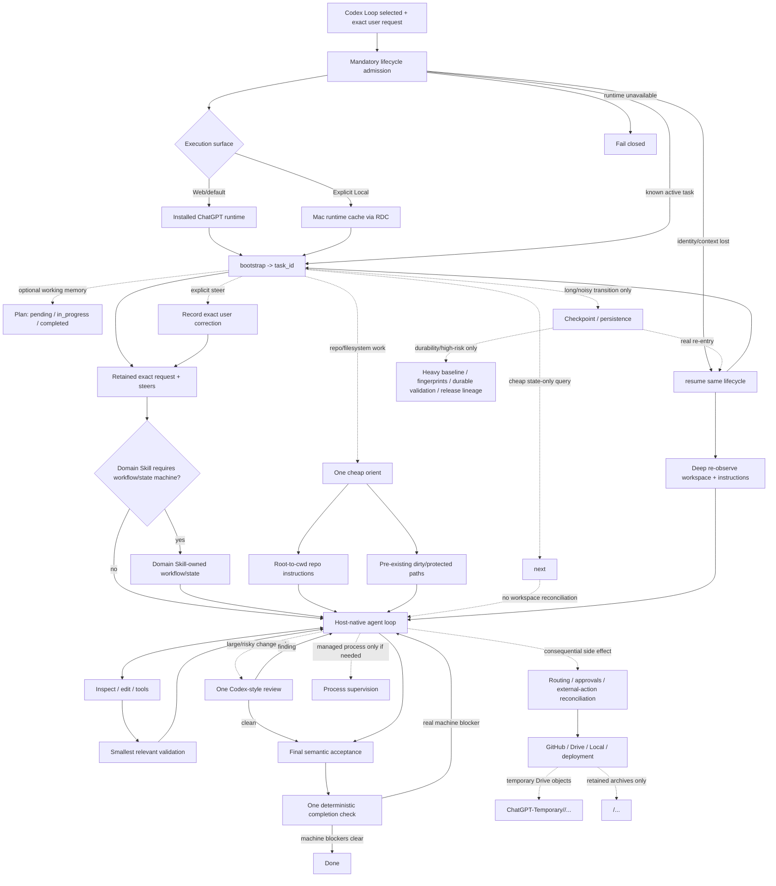

# Codex Loop Architecture

## Boundaries

- **Lifecycle admission remains mandatory.** Once selected, Codex Loop must create or resume its lifecycle before any substantive task action. This invariant is not optimized away.
- **Exact user authority is canonical.** The initial request plus later steers define what the agent is authorized to do. A model-written task objective or acceptance restatement is not created for the same task.
- **The active loop is host-native.** After admission and any required one-time `orient`, ordinary inspection, editing, shell commands, tests, and repairs go directly through host tools. Codex Loop is not a workflow engine and does not sit between normal tool calls.
- **Domain workflows remain domain-owned.** If another selected Skill requires a workflow/state machine, Codex Loop keeps its lifecycle around that workflow but does not flatten or replace the Skill's states/transitions.
- **Normal model-facing context is authority-first and low-noise.** It contains the exact request/steers, a short execution contract, minimal workspace identity, real machine blockers, and an optional short plan. Hashes, generations, validation history, changed-path inventories, receipts, and diagnostics remain runtime-side unless explicitly pulled or required by a capability.
- **`orient` is cheap.** Repository tasks establish repo identity, current branch/HEAD/status, applicable instructions, and pre-existing dirty paths without a full content fingerprint or repository-wide baseline.
- **Scoped instructions are stable authority.** Load root-to-cwd instructions during orientation and load a deeper scope only before first touching it. Do not rediscover instructions as a heartbeat.
- **`next` is state-only.** It never reconciles the repository, hashes workspace content, rediscover instructions, or suggests that the model should finish. Use it only when a cheap lifecycle-state read is useful.
- **`resume` owns real re-entry.** After context loss/reconnect/cross-turn recovery, resume the same lifecycle and re-observe the bound workspace and applicable instructions. Historical summaries or validation never outrank current reality.
- **Plan is optional working memory.** Its only states are `pending | in_progress | completed`; it is not authority and an unfinished plan is not a deterministic completion blocker.
- **Validation is direct by default.** The host runs the smallest relevant test/build/lint check. Durable validation receipts exist only for explicit high-risk/durable workflows such as release/publication/persistence.
- **One semantic acceptance, one machine completion check.** The model first compares the actual result with the exact request. `completion` then checks only machine-observable blockers and never certifies semantic correctness or emits a “finish now” instruction.
- **Heavy reconciliation is lazy.** Full file baselines, ignored-file watches, workspace fingerprints, generation-based freshness, release lineage, and persistence are activated only when durable reconstruction or high-risk publication actually requires them.
- **Deterministic governance stays at real side-effect boundaries.** Non-idempotent external actions, routing, sandbox/approval, protected user work where durable tracking is active, workspace identity, and task-owned process cleanup remain explicit machine checks.
- **Drive temporary storage has one root.** All ChatGPT-created temporary Drive objects live under `ChatGPT-Temporary`; top-level Skill-named folders are reserved for intentionally retained archive content.
- **The host owns model sampling and normal tool execution.** Codex Loop does not recreate Codex's session runtime, token manager, sandbox, approval engine, or tool dispatcher.
