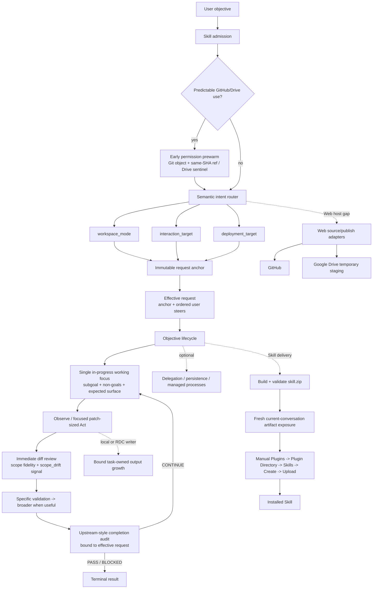

# Codex Loop Architecture

## Boundaries

- ChatGPT host owns model sampling, tool dispatch, sandboxing, approvals, connector authentication, conversation context, and the actual current-conversation artifact reference.
- Codex Loop owns objective continuity plus deterministic state that is genuinely needed for execution.
- Request authority is separate from execution summaries. `request_anchor` is immutable after bootstrap; ordered user steers extend the effective request; objective, criteria, and working focus are derived execution aids.
- The working focus carries one `in_progress` subgoal plus optional non-goals and expected change surface. `scope_drift` compares observed changed paths with that surface as a review signal only; it is not a mutation authorization or hard completion gate.
- Existing-code mutation follows upstream Codex precision semantics: smallest coherent patch-sized edit, immediate diff inspection, no unrelated refactors/bug fixes/test repairs, and validation from the most specific requested behavior toward broader checks only when useful.
- Completion audit identity is the effective-request hash plus current mutation generation. A steer invalidates request-bound audit evidence; rewriting the working objective does not.
- The Skill router is the lifecycle admission; Codex Loop does not run a second direct-vs-durable admission classifier.
- Routing keeps the three independent axes because identical semantic intents may require different transports in Web and Local environments.
- GitHub/Drive permission prewarm is intentionally early. Web publication prewarms both Git-object write and persistent-ref write with a no-movement same-SHA ref update; Drive write/delete is prewarmed with an exact create/read/delete sentinel.
- Local/RDC execution safety bounds task-owned output growth directly. It does not use remaining free disk as a task-admission threshold.
- Review is semantic model work over the actual final diff, not a stored review receipt. Git state is observed directly rather than pre-authorized through bookkeeping.
- Exact Codex Loop-created permission sentinels and staging objects are cleaned automatically. Pre-existing user files and durable deliverables remain outside that cleanup authority.
- Skill package bytes, fresh conversation artifact exposure, and product installation are separate boundaries. Generated Skill packages are never routed through a presumed Library object; ChatGPT Web installation is the manual upload path shown above.
