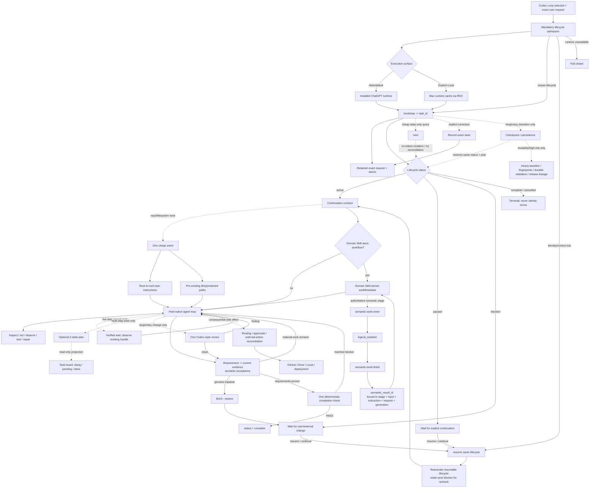

# Codex Loop Architecture

## Boundaries

- **Lifecycle admission remains mandatory.** Once selected, Codex Loop must create or resume its lifecycle before any substantive task action. This invariant is not optimized away.
- **Exact user authority is canonical.** The initial request plus later steers define what the agent is authorized to do. A model-written task objective or acceptance restatement is not created for the same task.
- **Lifecycle status is explicit but thin.** `active | paused | blocked | complete | cancelled` controls whether work may proceed; it is separate from plan state. `paused` is user-driven, `blocked` requires a concrete impasse, and terminal states never silently resume.
- **The active loop is host-native.** After admission and any required one-time `orient`, ordinary inspection, editing, shell commands, tests, and repairs go directly through host tools. Codex Loop is not a workflow engine and does not sit between normal tool calls.
- **Domain workflows remain domain-owned.** If another selected Skill requires a workflow/state machine, Codex Loop keeps its lifecycle around that workflow but does not flatten or replace the Skill's states/transitions.
- **Authoritative domain semantic work has one execution path.** A coupled domain Skill may declare a stage as authoritative semantic work. That stage must enter `semantic-work-enter`, execute inside `logical_isolation`, and finish through `semantic-work-finish`. Only that path mints a `semantic_result_id`; generic delegation results, caller-authored PASS JSON, hashes, receipts, or domain helper scripts cannot substitute for it.
- **Semantic results are exact and fresh.** Each `semantic_result_id` is bound to consumer, stage, exact semantic input hash, governing instruction hash, effective user-request hash, and Codex Loop generation. `semantic-result` fails closed on a binding mismatch, on workspace mutation or a user steer during the isolation, or after a later mutation/steer makes the result stale.
- **Semantic-result persistence is structurally lossless.** Authoritative semantic JSON is sanitized without list/dict truncation, then checked against the total semantic-result byte limit. Oversized semantic results fail closed instead of silently dropping items; bounded structural scrubbing remains only for non-authoritative diagnostic/runtime state.
- **Logical isolation keeps its existing meaning.** It remains behavioral rather than physical context isolation. The new semantic authority contract does not claim cryptographic proof of cognition; it removes the domain-runtime bypass by making logical isolation the only Codex Loop path that can mint authoritative semantic work.
- **Normal model-facing context is authority-first and low-noise.** It contains the exact request/steers, a short continuation contract, lifecycle status, minimal workspace identity, real machine blockers/live work, and an optional short plan/task-board projection. Hashes, generations, validation history, changed-path inventories, receipts, and diagnostics remain runtime-side unless explicitly pulled or required by a capability.
- **`orient` is cheap.** Repository tasks establish repo identity, current branch/HEAD/status, applicable instructions, and pre-existing dirty paths without a full content fingerprint or repository-wide baseline.
- **Scoped instructions are stable authority.** Load root-to-cwd instructions during orientation and load a deeper scope only before first touching it. Do not rediscover instructions as a heartbeat.
- **`next` is state-only.** It exposes status, plan/task-board state, and known live work without changing `paused`/`blocked`, reconciling the repository, hashing workspace content, rediscovering instructions, or suggesting that the model should finish. Use it only when a cheap lifecycle-state read is useful.
- **`resume` owns real re-entry and user continuation.** Active stays active; paused/blocked are reactivated as a new attempt to advance the same objective, with the prior blocker returned for mandatory re-observation; complete/cancelled cannot resume. After re-entry, re-observe the bound workspace, live work, and applicable instructions. Historical summaries or validation never outrank current reality.
- **Workspace recovery keeps the same lifecycle.** If a stale/legacy binding lacks enough Git identity to prove a move, `source-acquisition-verify --task-id` records stronger exact repository/commit/tree/origin evidence and `orient --rebind-verified` consumes it. Never bootstrap a replacement task or manually rewrite lifecycle state just to escape a workspace mismatch.
- **Plan is optional durable working memory.** Its only states are `pending | in_progress | completed`; the task board is a pure read-only projection of that same plan. Neither is authority or a deterministic completion blocker.
- **Validation is direct by default.** The host runs the smallest relevant test/build/lint check. Durable validation receipts exist only for explicit high-risk/durable workflows such as release/publication/persistence.
- **One semantic acceptance, one machine completion transition.** The model treats completion as unproven, derives material requirements from the request, and verifies them against current evidence. Only then does `completion` check machine-observable blockers; `PASS` transitions `active -> complete` without pretending the runtime certified semantic correctness.
- **Heavy reconciliation is lazy.** Full file baselines, ignored-file watches, workspace fingerprints, generation-based freshness, release lineage, and persistence are activated only when durable reconstruction or high-risk publication actually requires them.
- **Deterministic governance stays at real side-effect boundaries.** Non-idempotent external actions, routing, sandbox/approval, protected user work where durable tracking is active, workspace identity, and task-owned process cleanup remain explicit machine checks.
- **Drive temporary storage has one root.** All ChatGPT-created temporary Drive objects live under `ChatGPT-Temporary`; top-level Skill-named folders are reserved for intentionally retained archive content.
- **The host owns model sampling and normal tool execution.** Codex Loop does not recreate Codex's session runtime, token/budget manager, native multi-agent runtime, Plan Mode, Guardian/approval engine, tool dispatcher, or automatic idle-turn scheduler. No Composer DAG is introduced; the host-native agent loop remains the dynamic execution graph.
