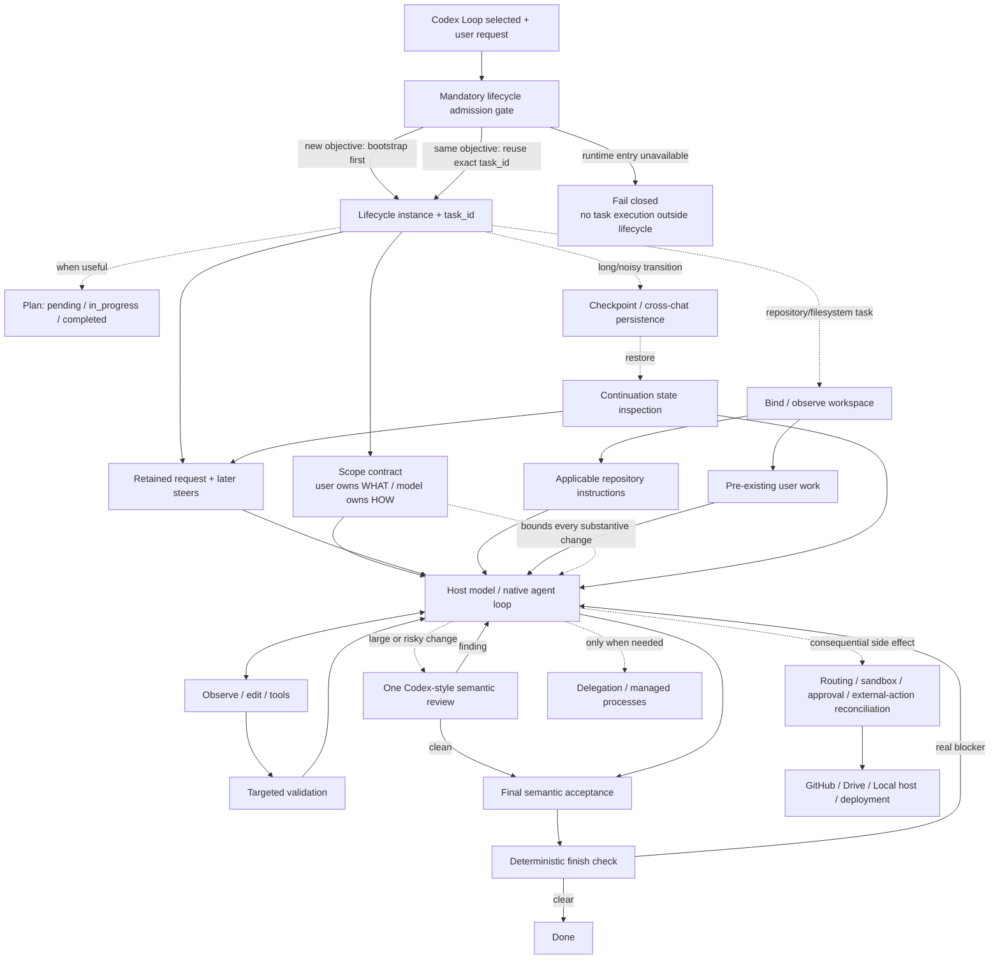

# Codex Loop Architecture

## Boundaries

- The effective user request plus later user corrections is the scope authority. Plans, objectives, reviews, architecture preferences, discovered cleanup, and model judgment may choose execution but never authorize additional work.
- Skill selection requires lifecycle admission before any substantive task action. For a new objective, `bootstrap` is the first task action and returns the `task_id`; an already-admitted continuation reuses that exact `task_id`. Skill-entrypoint loading itself is not task execution.
- The admission boundary fails closed. If the host cannot execute the runtime entrypoint, Codex Loop does not degrade into ordinary chat/tool execution. The current ChatGPT Skill surface cannot make this a native host dispatch interceptor, so the contract is enforced by the Skill entrypoint until such a hook exists.
- The standard lifecycle is always active and lightweight after admission: retain request authority, observe the relevant environment, execute natively, validate where useful, perform final semantic acceptance, then run deterministic finish checks.
- Workspace binding is lifecycle-internal and optional. Repository/filesystem work loads scoped repository instructions and pre-existing user work before mutation; deeper instruction scopes are loaded before first touch.
- Continuation words such as `continue` / `resume` / `继续` first inspect the existing lifecycle state and current reality. They never create a replacement lifecycle or reset the request anchor.
- The host model owns reasoning, task decomposition, ordinary inspection/edit/test/repair decisions, semantic review, and final acceptance inside the user-authorized scope.
- Codex Loop lifecycle state is intentionally thin and mandatory. Plans, workspace baselines, checkpoints, cross-chat persistence, delegation, and process/external-action bookkeeping are added only when the objective uses them.
- `completion` checks deterministic blockers only. It is not an outer semantic review and does not require criterion PASS records, steer acknowledgements, repeated fresh checker passes, or a requirement-by-requirement objective audit.
- Validation is host-visible and direct. A host-observed result can be recorded without a validation-plan handshake. Repairs trigger only affected revalidation unless broader regression confidence is justified.
- A separate semantic review is optional and normally singular. Large/risky changes use one Codex-style review over the actual change; substantive findings are repaired and targeted checks rerun.
- Routing, sandbox/approval, non-idempotent external-action reconciliation, protected user work, and task-owned process cleanup remain deterministic because they guard real side effects rather than reasoning quality.
- Persistence, delegation, managed processes, publication adapters, workspace cache, and GUI/browser routing remain lazy branches; they add no steps to the default happy path when unused.
- ChatGPT host owns model sampling, tool dispatch, connector authentication, sandboxing/approvals, hidden context, and conversation persistence.
