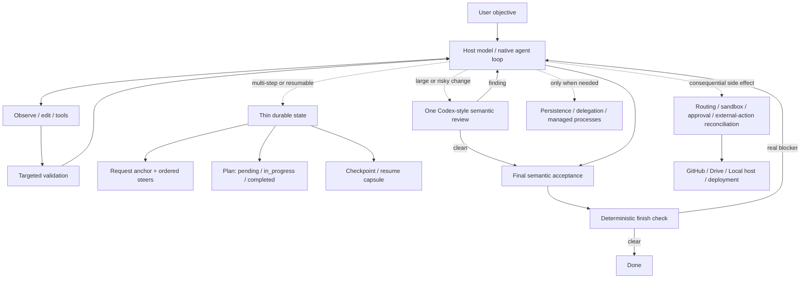

# Codex Loop Architecture

## Boundaries

- The host model owns reasoning, task decomposition, ordinary inspection/edit/test/repair decisions, semantic review, and final acceptance.
- Codex Loop durable state is intentionally thin: immutable request anchor, ordered user steers, optional three-state plan, lightweight checkpoint/resume data, and machine-observable side-effect/process state.
- `completion` checks deterministic blockers only. It is not an outer semantic review and does not require criterion PASS records, steer acknowledgements, repeated fresh checker passes, or a requirement-by-requirement objective audit.
- Validation is host-visible and direct. A host-observed result can be recorded without a validation-plan handshake. Repairs trigger only affected revalidation unless broader regression confidence is justified.
- A separate semantic review is optional and normally singular. Large/risky changes use one Codex-style review over the actual change; substantive findings are repaired and targeted checks rerun.
- Routing, sandbox/approval, non-idempotent external-action reconciliation, protected user work, and task-owned process cleanup remain deterministic because they guard real side effects rather than reasoning quality.
- Persistence, delegation, managed processes, publication adapters, workspace cache, and GUI/browser routing remain lazy branches; they add no steps to the default happy path when unused.
- ChatGPT host owns model sampling, tool dispatch, connector authentication, sandboxing/approvals, hidden context, and conversation persistence.
